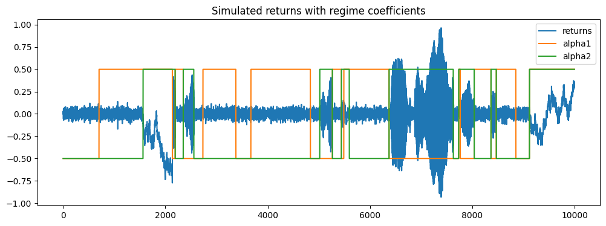
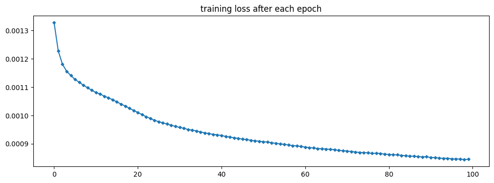

# Why K-fold CV Fails in Financial ML
A compact, reproducible project that demonstrates how standard K-fold cross-validation can produce optimistic (misleading) performance estimates in financial machine learning. (Referencing chapter 7 of 'Advances in Financial Machine Learning' by Prado.)

The simulation uses a regime-switching AR(2) return generator and a small Keras model. The goal: show K-fold (contiguous blocks) appears to perform well **in-sample** while true forward (time-aware) test performance is much worse.

## Introduction

López de Prado points out two main reasons K-fold fails in finance:

1. **Non-IID data (autocorrelation/regime shifts).**
2. **Repeated testing/model selection bias** (re-using the same set of data in both training and validation).

* Our return generator uses an AR(2) process with parameters switching slowly but randomly. As the parameters are stable locally, predictivity is high near the training set and very low far in the future. This produces the non-iid property of financial data. (Practically, regime shifts (eg, bull/bear markets) are very common in finance as well)
* Our Keras model trained with access to *both past and future* return data, causing some training data to be reused in validation. This demonstrates the second point above.
* This repo contains: simulator, feature builder, Keras model, K-fold CV loop, and holdout test. 

## Functions in `model.py`

* `arreturn()` — regime-switching AR(2) simulator.
* `features_label()` - builder that turns returns → lag features and labels.
* `flawed_model()` - A neural network to model future returns using past returns. Intentionally to be overfitting.
* `Kfold()` - An implementation of k-fold CV for the flawed_model 

## Usage

* Here are short, runnable snippets.

```py
from model import (
    arreturn,
    features_label,
    flawed_model,
    kfold_cv
)
rng = np.random.default_rng(76)
returns, alphas = arreturn(rng)

X, Y = features_label(returns)

full_model = flawed_model(X.shape[1])

val_losses = kfold_cv(X, Y)

print("\nMean CV loss:", np.mean(val_losses))
```


## Demo and Typical Results

* `model_demos.ipynb` -  A notebook that generates returns, runs in-sample training, K-fold CV, and out-of-sample evaluation; also generates plots.

In the notebook, we generate an array of 10000 returns. The following plot shows the simulation results with regime changes.


We then fit the first 404 data to the model. The training error is in line with the variance of noise, $0.03^2$, showing that the model memorised the local regime.



We also performed K-fold CV and a holdout test. CV error is very low as well, but the OOS error is terribly high.


Typical behaviour you should observe:

* **Low training loss** (model can fit in-sample).
* **K-fold mean CV loss** often low (appears optimistic).
* **True out-of-sample (holdout) loss** is substantially higher.
* **Interpretation:** Because K-fold contiguous blocks allow training folds to include data both before and after a validation block, the training set often contains samples from the *same local regime* as the validation block (i.e., the model effectively learned that regime). In real deployment, you do not have those future samples — hence, real OOS performance degrades.

## Parameters Tuning

* `avg_regime_length` (in simulator): increase → model memorises local regimes more (more divergence between K-fold CV and OOS).
* `q` (number of lags in features): increase q to give the model more history, causing more overfitting.
* `n_splits` in K-fold: fewer splits → larger validation blocks; effect changes how much future information is inside training folds.
* Optimiser/model capacity/epochs: increasing capacity + epochs tends to make the model memorise local regimes (more divergence between K-fold CV and OOS).


## References

Marcos Lopez De Prado, Advances in Financial Machine Learning (New Jersey: Wiley, 2018), 103-105

## License

MIT — feel free to reuse & adapt for research/teaching. 

## Contact/Author

Cyrus Tang — Github: cyrustang147


