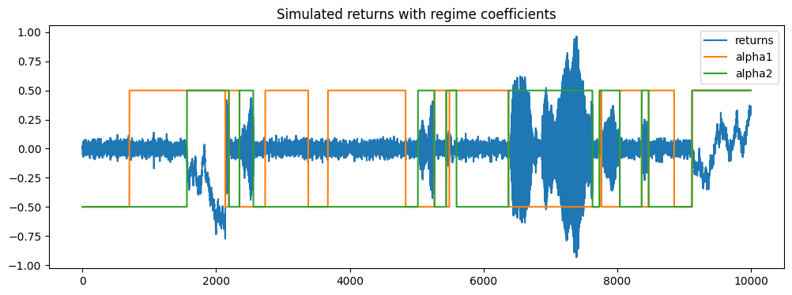
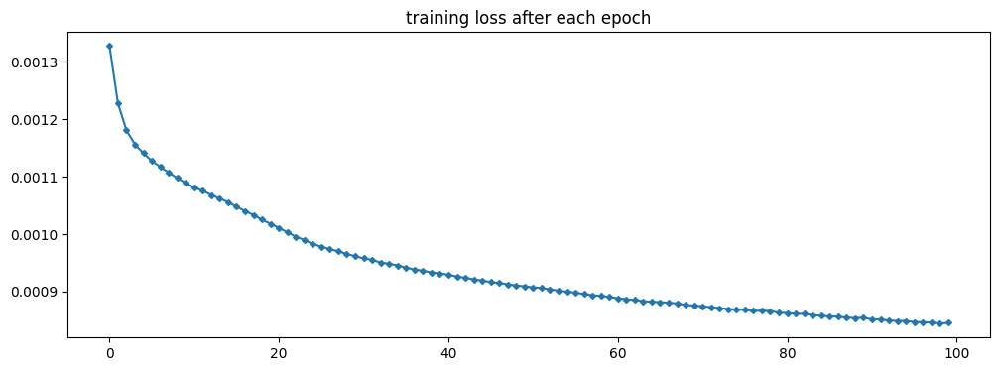
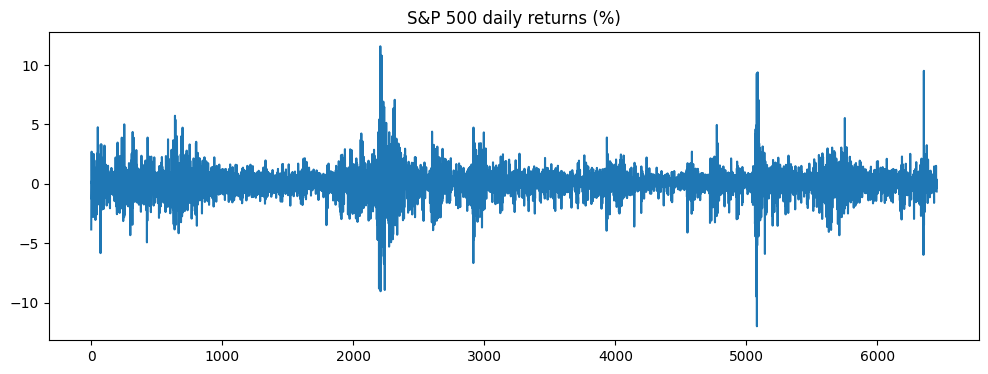
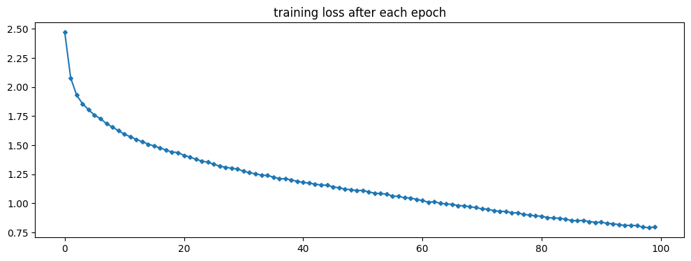

In `model_demos.ipynb`, we demonstrated why k-fold CV fails with both synthetic data and real data.

## Synthetic Data

We generate an array of 10000 returns based on an AR(2) process whose parameters switch between (0.5, 0.5), (-0.5, 0.5), (0.5, -0.5), and (-0.5, -0.5). We intentionally set some of them to be slightly non-stationary to create dynamics. The default average regime length is 500. The following plot shows the simulation results with regime changes.

For an event at time $t$, we try to predict the return at time $t+1$ with the $q$ previous returns ($r_t, r_{t-1},...$). In this case, we set $q=4$.

We then fit a neural network model to the first 404 returns. The model consists of two hidden layers and a total of 225 parameters. We intentionally overfit the model to force memorisation of the local regime. This gives a low training error of 8.5e^-4, in line with the variance of noise, $0.03^2$.

We also performed k-fold CV and a holdout test. CV error is very low as well, but the OOS error is terribly high. The model is perfect at a local regime, but when parameters vary and the AR(2) process changes, the model performs poorly.

## Real SPX data

The example above clearly demonstrates the issue with k-fold cross-validation in finance. However, it seems like we manually adjusted the simulator and model to achieve this effect. Let's try with some real-life data.

We pull out the last 25-year S&P 500 closing prices from Yahoo Finance. Here is the returns chart.

Real-life data is a bit more complex than our simulated data, so we increased $q$ from $4$ to $6$ and changed the learning rate from $1e-4$ to $2e-3$. We did not fine-tune these hyperparameters. The training set has 206 return data (206 observations), and here is the convergence of training loss.

In the k-fold CV, we split the training set into 50 groups, that is, 4 observations per group. This amplifies the overlapping of training data and validation data. The following are the training error, k-fold CV mean error, and OOS testing error. The errors are much higher overall since our model is obviously too simple, but still, the OOS error is substantially higher than the CV error.

